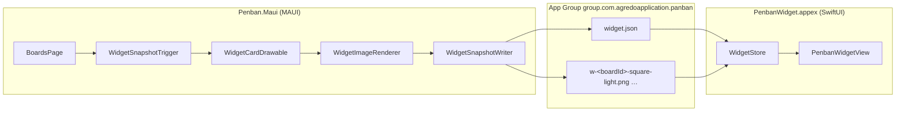

# Penban Widget (iOS)

Das Home-Screen-Widget zeigt die BoardCard der Übersicht – ohne Teilen-, Umbenennen- und
Löschen-Knopf – in den drei Größen `systemSmall`, `systemMedium` und `systemLarge`.

Dieser Ordner ist ein eigenes Xcode-Projekt. Die MAUI-Toolchain kann keine `.appex` erzeugen; sie
bettet nur ein fertiges Bundle ein. Deshalb ist die Arbeit geteilt:



Die App zeichnet die Karte **einmal pro Board, Größe und Erscheinungsbild** als PNG und legt sie
zusammen mit einer kleinen JSON-Beschreibung im geteilten Ordner ab. Das Widget lädt nur noch das
passende Bild. Damit gibt es genau einen Zeichner der Karte – `WidgetCardDrawable` in
`Penban.Maui.Views/Widget` – und die Schriften und die Tinte der Notizen müssen hier nicht ein
zweites Mal nachgebaut werden.

## Inhalt

| Pfad | Zweck |
| --- | --- |
| `Sources/WidgetSnapshot.swift` | Lese-Vertrag für `widget.json`; die Feldnamen müssen zu `Penban.Maui.Views/Widget/WidgetSnapshot.cs` passen |
| `Sources/WidgetStore.swift` | Geteilter Ordner und Zugriff auf die Dateien darin |
| `Sources/PenbanBoardIntent.swift` | Board-Auswahl in der Widget-Konfiguration (AppIntents) |
| `Sources/PenbanWidget.swift` | `Widget`-Definition, Timeline-Provider und Ansicht |
| `Resources/Info.plist` | Extension-Platzhalter `com.apple.widgetkit-extension` |
| `Resources/PenbanWidget.entitlements` | App Group – **dieselbe** wie in der App |
| `Resources/Localizable.xcstrings` | Deutsche Texte der Extension |
| `project.yml` | XcodeGen-Definition; erzeugt `PenbanWidget.xcodeproj` |
| `build/` | Build-Ausgabe (nicht im Repo) |

## Voraussetzungen

1. **App Group im Developer Portal anlegen.** `developer.apple.com` → Certificates, Identifiers &
   Profiles → Identifiers → **App Groups** → `group.com.agredoapplication.panban`. Danach die Gruppe
   beiden App-IDs zuordnen:
   - `com.agredoapplication.panban` (die App)
   - `com.agredoapplication.panban.WidgetExtension` (die Extension, als neue App-ID anlegen:
     Explicit App ID, Capability **App Groups**)
2. **Provisioning-Profile neu erzeugen** (die alten kennen die App Group noch nicht) und in Xcode
   laden – die App nutzt im Release-Build das App-Store-Profil, siehe `scripts/ios-testflight.sh`.
3. `brew install xcodegen` (oder das Ziel einmalig von Hand anlegen, siehe unten).
4. Signing-Team `NTMYS336K2` – eine Extension aus einem fremden Team lässt sich nicht einbetten.

## Bauen

Auf dem Mac, aus dem Repo-Wurzelverzeichnis:

```bash
scripts/ios-widget.sh build          # erzeugt das Projekt und baut Release
scripts/ios-testflight.sh build      # baut die App samt Widget
```

`scripts/ios-widget.sh build` legt das Ergebnis unter
`Penban/Penban.Widget.iOS/build/Release-iphoneos/PenbanWidget.appex` ab – genau dort, wo
`Penban.Maui.csproj` es über `AdditionalAppExtensions` sucht. Das Skript prüft anschließend, dass
Bundle-ID und App Group der Extension stimmen; beides fällt sonst erst auf dem Gerät auf, wo die
Extension einfach nicht in der Galerie erscheint.

Der MAUI-Build überspringt die Extension, wenn kein `.appex` da ist, und **warnt** dabei
(`WarnMissingWidgetExtension`). So bleibt der Build auf einer Maschine ohne Xcode möglich, ohne dass
ein Release ohne Widget unbemerkt durchgeht.

### Wie die Einbettung funktioniert

`AdditionalAppExtensions` bekommt in `Penban.Maui.csproj` **nicht** den Pfad zum `.appex`, sondern
den Ordner plus den Unterordner:

```xml
<AdditionalAppExtensions Include="…/Penban.Widget.iOS/build">
  <Name>PenbanWidget</Name>
  <BuildOutput>Release-iphoneos</BuildOutput>
  <CodesignEntitlements>…/Penban.Widget.iOS/Resources/PenbanWidget.entitlements</CodesignEntitlements>
</AdditionalAppExtensions>
```

.NET for iOS setzt daraus `Include` + `BuildOutput` + `Name` + `.appex` zusammen; `BuildOutput`
existiert genau deshalb, weil Xcode Simulator- und Gerätebuilds in getrennte Ordner legt.

Die `CodesignEntitlements` sind **nicht optional**: die Extension wird beim Einbetten in
`Penban.app/PlugIns/` kopiert und dabei wird die Signatur, die Xcode gemacht hat, gelöscht. Die
`.appex` wird danach neu signiert – ohne diese Angabe ohne App Group, und ein Widget ohne App Group
sieht den geteilten Ordner nicht und bleibt leer. Die Datei enthält nur die App Group;
`application-identifier` und `keychain-access-groups` zieht .NET for iOS beim Signieren aus dem
Provisioning Profile.

### Ohne XcodeGen

`PenbanWidget.xcodeproj` in Xcode von Hand anlegen:

1. File → New → Project → **Widget Extension**, Name `PenbanWidget`, „Include Live Activity" und
   „Include Configuration App Intent" **abwählen** (die Konfiguration kommt aus
   `PenbanBoardIntent.swift`).
2. Projekt speichern als `Penban/Penban.Widget.iOS/PenbanWidget.xcodeproj`.
3. Die vom Assistenten erzeugten Dateien löschen und die Dateien aus `Sources/` sowie
   `Resources/Localizable.xcstrings` ins Ziel ziehen.
4. Ziel-Einstellungen → General: Bundle Identifier `com.agredoapplication.panban.WidgetExtension`,
   Version `0.3.1`, Build `7`, Minimum Deployments **iOS 17.0** (nötig für
   `containerBackground(for: .widget)`), Signing Team `NTMYS336K2`.
5. Signing & Capabilities → **+ Capability** → App Groups → `group.com.agredoapplication.panban`.
6. Build Settings: `INFOPLIST_FILE` = `Resources/Info.plist`, `GENERATE_INFOPLIST_FILE` = No,
   `CODE_SIGN_ENTITLEMENTS` = `Resources/PenbanWidget.entitlements`, `SKIP_INSTALL` = Yes.

## Prüfen

1. Penban auf dem Gerät öffnen und die Board-Übersicht aufrufen – erst dabei schreibt die App den
   Snapshot.
2. Home-Screen → Widget hinzufügen → Penban. Beim Ablegen öffnet sich die Konfiguration; ohne
   Auswahl zeigt das Widget das erste Board der Übersicht.
3. Größen: klein und mittel zeigen zusätzlich den Notizstapel, groß zusätzlich die Spaltenleiste.
   Dunkelmodus wird über ein zweites Bild abgedeckt.
4. Änderungen an Titel, Notizen oder Karten erscheinen nach kurzer Verzögerung (der Auslöser wartet
   ~2 s, bis die Änderungen sich beruhigt haben) – ein Aktualisieren erzwingt es sofort.

## Wenn nichts erscheint

| Symptom | Ursache |
| --- | --- |
| „Öffne Penban, um das Widget zu füllen." | Es liegt keine `widget.json` im geteilten Ordner: App Group fehlt in einem der beiden Ziele, oder die Übersicht wurde seit der Installation noch nicht geöffnet |
| „Noch keine Boards." | Snapshot vorhanden, aber ohne Board |
| Widget erscheint nicht in der Galerie | Bundle-ID-Präfix, App Group oder Version stimmen nicht; `scripts/ios-widget.sh build` prüft die ersten beiden |
| Karte fehlt, Kachel bleibt leer | Das PNG zum Board fehlt – die Dateinamen in `widget.json` müssen zu den Bildern im Ordner passen (`w-<boardId>-<größe>-<hell\|dunkel>.png`) |
| Änderungen kommen nicht an | Signatur unverändert, deshalb kein Neuschreiben; die App stößt `reloadAllTimelines` an, das System drosselt es aber |
| Widget da, aber dauerhaft „Öffne Penban…", obwohl der Snapshot existiert | Die `.appex` wurde ohne App Group signiert – `CodesignEntitlements` in `Penban.Maui.csproj` prüfen und auf dem Gerät mit `codesign -d --entitlements :- Penban.app/PlugIns/PenbanWidget.appex` nachsehen |

Der geteilte Ordner lässt sich auf dem Mac einsehen, wenn das Gerät per Kabel verbunden ist:

```bash
xcrun devicectl device info files --device <udid> --domain-type appGroup \
  --domain-identifier group.com.agredoapplication.panban
```

## Vertrag mit der App

`widget.json` wird von `WidgetSnapshotWriter` geschrieben. Wer hier ein Feld umbenennt, muss es
gleichzeitig in `Penban/Penban.Maui.Views/Widget/WidgetSnapshot.cs` tun – der `JSONDecoder` ist
nicht tolerant und ein einzelner unbekannter Name lässt die ganze Datei durchfallen.

```json
{
  "schemaVersion": 1,
  "updatedAtUtc": "2025-01-01T12:00:00.0000000Z",
  "signature": "…",
  "boards": [
    {
      "id": "9f0c…",
      "title": "Projekt",
      "summary": "3 Spalten · 12 Karten",
      "cardCount": 12,
      "hasNote": true,
      "noteColorIndex": 2,
      "lastEditedUtc": "2025-01-01T11:59:00.0000000Z",
      "columns": [ { "title": "Neu", "count": 4, "colorIndex": 0, "share": 5, "opacity": 1 } ],
      "notes": [ { "colorIndex": 4, "tilt": -8, "offsetX": -30, "offsetY": 0 } ],
      "images": {
        "squareLight": "w-9f0c…-square-light.png",
        "squareDark":  "w-9f0c…-square-dark.png",
        "wideLight":   "w-9f0c…-wide-light.png",
        "wideDark":    "w-9f0c…-wide-dark.png",
        "tallLight":   "w-9f0c…-tall-light.png",
        "tallDark":    "w-9f0c…-tall-dark.png"
      }
    }
  ]
}
```

`schemaVersion` wird geprüft: ein Dokument aus einer anderen Version wird ignoriert, statt halb
gelesen zu werden. Beim Ändern des Formats also `WidgetSnapshot.CurrentSchemaVersion` **und**
`WidgetSnapshot.currentSchemaVersion` gemeinsam hochziehen.
