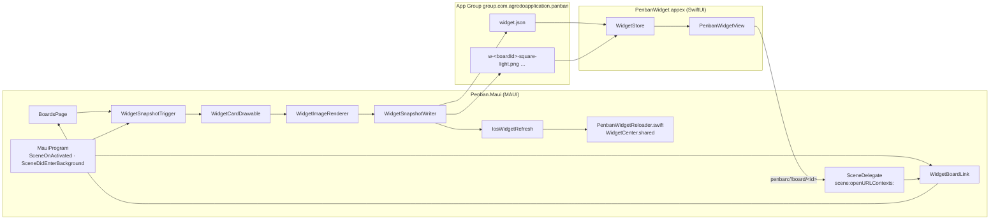

# Penban Widget (iOS)

Das Home-Screen-Widget zeigt die BoardCard der Übersicht – ohne Teilen-, Umbenennen- und
Löschen-Knopf – in den drei Größen `systemSmall`, `systemMedium` und `systemLarge`.

Dieser Ordner ist ein eigenes Xcode-Projekt. Die MAUI-Toolchain kann keine `.appex` erzeugen; sie
bettet nur ein fertiges Bundle ein. Deshalb ist die Arbeit geteilt:


```mermaid
flowchart LR
    subgraph App["Penban.Maui (MAUI)"]
        A[BoardsPage]
        L["MauiProgram<br/>SceneOnActivated · SceneDidEnterBackground"]
        Q["SceneDelegate<br/>scene:openURLContexts:"]
        A --> B[WidgetSnapshotTrigger]
        L --> B
        L --> U[WidgetBoardLink]
        Q --> U
        U --> A
        B --> C[WidgetCardDrawable]
        C --> D[WidgetImageRenderer]
        D --> E[WidgetSnapshotWriter]
        E --> R[IosWidgetRefresh]
        R --> S["PenbanWidgetReloader.swift<br/>WidgetCenter.shared"]
    end
    subgraph Group["App Group group.com.agredoapplication.panban"]
        F[widget.json]
        G["w-&lt;boardId&gt;-square-light.png …"]
    end
    subgraph Ext["PenbanWidget.appex (SwiftUI)"]
        H[WidgetStore] --> I[PenbanWidgetView]
    end
    E --> F
    E --> G
    F --> H
    G --> H
    I -->|"penban://board/&lt;id&gt;"| Q
```

Die App zeichnet die Karte **einmal pro Board, Größe und Erscheinungsbild** als PNG und legt sie
zusammen mit einer kleinen JSON-Beschreibung im geteilten Ordner ab. Das Widget lädt nur noch das
passende Bild. Damit gibt es genau einen Zeichner der Karte – `WidgetCardDrawable` in
`Penban.Maui.Views/Widget` – und die Schriften und die Tinte der Notizen müssen hier nicht ein
zweites Mal nachgebaut werden.

## Wann geschrieben wird

`WidgetSnapshotTrigger` ist ein **Singleton der App**, nicht der Übersichtsseite. Er hält die
Übersicht, die gerade sichtbar ist (`Attach`), und schreibt aus ihr:

| Auslöser | Wann |
| --- | --- |
| `BoardsPage.OnAppearing` → `RefreshAsync` | Die Übersicht ist vollständig (Neustart, Rückkehr von einem Board) |
| Boardliste geändert / Board-Eigenschaft geändert | Nach ~2 s Ruhe: Anlegen, Umbenennen, Löschen, neu gelesene Zeilen |
| `MauiProgram` → `SceneDidEnterBackground` | Beim Verlassen der App – der Moment, in dem der Nutzer zum Home-Screen und damit zum Widget geht |

Vor jedem Schreiben liest der Trigger die Zeilen über `LoadSummaryAsync` neu: ein Board wird nicht
neu gebaut, wenn auf ihm etwas passiert ist, und ohne dieses Nachlesen hätte die Karte die alten
Zahlen – und der Schreiber würde die Datei nicht einmal anfassen, weil sich für ihn nichts geändert
hat. Die eigene Ankündigung des Nachlesens wird dabei unterdrückt, sonst schriebe jede Zeile erneut.

`WidgetSnapshotWriter` schreibt nur, wenn sich die Signatur geändert hat oder Bilder fehlen;
danach ruft er `IosWidgetRefresh.ReloadAllTimelines()`.

## Aktualisieren und Öffnen

Beides läuft über die Extension hinaus und braucht Wege, die C# allein nicht hat:

- **Neuzeichnen.** WidgetKit zeichnet nur auf Anforderung neu, und `WidgetCenter` ist
  **Swift-only** – es gibt keine Objective-C-Klasse dieses Namens (`objc_getClass("WidgetCenter")`
  ist `nil`). `Platforms/iOS/PenbanWidgetReloader.swift` ist deshalb
  `@objc(PenbanWidgetReloader)`, wird vom Target `LinkWidgetReloader` in `Penban.Maui.csproj` mit
  `xcrun swiftc` übersetzt und per `-Wl,-force_load` in die App gelinkt (das Objekt wird sonst
  weggelassen, weil niemand es über ein Symbol referenziert). `IosWidgetRefresh` ruft die Methode
  über `objc_msgSend` auf.
- **Öffnen.** Die Ansicht trägt `.widgetURL(penban://board/<id>)`; `Info.plist` der App meldet das
  Schema unter `CFBundleURLTypes` an. Der Tap landet bei `SceneDelegate.OpenUrl`: seit dem
  Szenen-Lebenszyklus (`UIApplicationSceneManifest` in `Platforms/iOS/Info.plist`) bekommt die
  geöffneten URLs die Szene und nicht mehr die App, und bei einem Kaltstart kommt die URL sofort
  nach dem Verbinden der Szene – dann gibt es den MAUI-Fenster-Handler noch nicht, über den die
  Lebenszyklus-Ereignisse der Szene laufen. Weil die App dabei noch im Hintergrund ist – und nach
  einem Kaltstart noch gar keine Übersicht existiert – merkt sich `WidgetBoardLink` nur das Board.
  Wer zuerst bereit ist, öffnet es: `SceneOnActivated` oder `BoardsPage.OnAppearing`.

## Inhalt

| Pfad | Zweck |
| --- | --- |
| `Sources/WidgetSnapshot.swift` | Lese-Vertrag für `widget.json`; die Feldnamen müssen zu `Penban.Maui.Views/Widget/WidgetSnapshot.cs` passen |
| `Sources/WidgetStore.swift` | Geteilter Ordner und Zugriff auf die Dateien darin |
| `Sources/PenbanBoardIntent.swift` | Board-Auswahl in der Widget-Konfiguration (AppIntents) |
| `Sources/PenbanWidget.swift` | `Widget`-Definition, Timeline-Provider und Ansicht |
| `Resources/Info.plist` | Extension-Platzhalter `com.apple.widgetkit-extension` |
| `Resources/PenbanWidget.entitlements` | App Group – **dieselbe** wie in der App |
| `Resources/Localizable.xcstrings` | Deutsche Texte der Extension |
| `project.yml` | XcodeGen-Definition; erzeugt `PenbanWidget.xcodeproj` |
| `build/` | Build-Ausgabe (nicht im Repo) |

## Voraussetzungen

1. **App Group im Developer Portal anlegen.** `developer.apple.com` → Certificates, Identifiers &
   Profiles → Identifiers → **App Groups** → `group.com.agredoapplication.panban`. Danach die Gruppe
   beiden App-IDs zuordnen:
   - `com.agredoapplication.panban` (die App)
   - `com.agredoapplication.panban.WidgetExtension` (die Extension, als neue App-ID anlegen:
     Explicit App ID, Capability **App Groups**)
2. **Provisioning-Profile neu erzeugen** (die alten kennen die App Group noch nicht) und in Xcode
   laden – die App nutzt im Release-Build das App-Store-Profil, siehe `scripts/ios-testflight.sh`.
3. `brew install xcodegen` (oder das Ziel einmalig von Hand anlegen, siehe unten).
4. Signing-Team `NTMYS336K2` – eine Extension aus einem fremden Team lässt sich nicht einbetten.

## Bauen

Auf dem Mac, aus dem Repo-Wurzelverzeichnis:

```bash
scripts/ios-widget.sh build                 # erzeugt das Projekt und baut die Extension (Release)
scripts/ios-testflight.sh build             # baut die App samt Widget für App Store Connect
scripts/ios-device.sh all                   # baut Widget und App fürs angeschlossene Gerät und installiert
scripts/ios-device.sh info                  # Geräte, Signierung und Stand der Extension anzeigen
```

`scripts/ios-widget.sh build` legt das Ergebnis unter
`Penban/Penban.Widget.iOS/build/Release-iphoneos/PenbanWidget.appex` ab – genau dort, wo
`Penban.Maui.csproj` es über `AdditionalAppExtensions` sucht. Das Skript liest Version und
Build-Nummer aus `Penban.Maui.csproj` und reicht sie an xcodebuild durch: die Extension trägt damit
immer die Version der App, und ein Upload zu App Store Connect kann nicht mehr an 90473 scheitern.
Anschließend prüft es Bundle-ID, App Group und Version der fertigen Extension; ohne das fällt ein
Fehler erst auf dem Gerät auf, wo die Extension einfach nicht in der Galerie erscheint.

Der MAUI-Build überspringt die Extension, wenn kein `.appex` da ist, und **warnt** dabei
(`WarnMissingWidgetExtension`). So bleibt der Build auf einer Maschine ohne Xcode möglich, ohne dass
ein Release ohne Widget unbemerkt durchgeht. Liegt eine `.appex` da, prüft er außerdem ihre Version
gegen die der App (`CheckWidgetExtensionVersion`) und bricht bei Abweichung ab – so kann ein
Überbleibsel eines früheren Builds nicht in ein Paket geraten.

### Auf ein Gerät laden

Wer die App mit `dotnet build` oder „Run" in Xcode auf ein iPhone oder iPad lädt, muss die Extension
in **derselben** Konfiguration vorher bauen – sonst liegt dort nur die Release-`.appex`, sie ist
App-Store-signiert, und iOS nimmt sie auf einem Entwicklungsgerät nicht an: das Widget fehlt in der
Galerie, ohne Fehlermeldung. `scripts/ios-device.sh` macht beides zusammen:

```bash
scripts/ios-device.sh all                       # Debug-Widget + Debug-App, installiert aufs erste verbundene Gerät
scripts/ios-device.sh all 00008130-0001234567890 # … auf ein bestimmtes Gerät
```

Das Skript wählt das Development-Profil des Geräts, leert `obj`/`bin` des
Gerätebuilds, baut mit `ios-widget.sh build Debug` die Extension, baut die App und prüft am fertigen
`Penban.app`, dass die Extension dabei, gleich versioniert, development-signiert und mit der App
Group versehen ist. Danach installiert es per `devicectl`.

Die andere Richtung – Gerätebuild mit `Release`-Appex – scheitert auch: das `.appex` aus einem
TestFlight-Build trägt die Beta-Entitlements, und das Gerät verweigert die Installation.

### Wie die Einbettung funktioniert

`AdditionalAppExtensions` bekommt in `Penban.Maui.csproj` **nicht** den Pfad zum `.appex`, sondern
den Ordner plus den Unterordner:

```xml
<AdditionalAppExtensions Include="…/Penban.Widget.iOS/build">
  <Name>PenbanWidget</Name>
  <BuildOutput>$(Configuration)-iphoneos</BuildOutput>
  <CodesignEntitlements>…/Penban.Widget.iOS/build/$(Configuration)-iphoneos/PenbanWidget.entitlements</CodesignEntitlements>
</AdditionalAppExtensions>
```

.NET for iOS setzt daraus `Include` + `BuildOutput` + `Name` + `.appex` zusammen; `BuildOutput`
existiert genau deshalb, weil Xcode Simulator- und Gerätebuilds in getrennte Ordner legt.

`BuildOutput` und `CodesignEntitlements` hängen **beide** an der Konfiguration, und das ist keine
Kosmetik: `Debug` wird mit einem Development-Profil signiert (`get-task-allow: true`), `Release` mit
dem App-Store-Profil (`beta-reports-active: true`, kein `get-task-allow`). Wäre die
Entitlements-Datei für beide dieselbe, überschriebe ein Gerätebuild sie mit `get-task-allow`, und
der nächste Release-Build signierte die Extension damit – App Store Connect lehnt das ab (90164).
`scripts/ios-widget.sh` legt sie deshalb nach `build/<Konfiguration>-iphoneos/PenbanWidget.entitlements`,
jede Konfiguration bekommt ihre eigene.

Die `CodesignEntitlements` sind **nicht optional**: die Extension wird beim Einbetten in
`Penban.app/PlugIns/` kopiert und dabei wird die Signatur, die Xcode gemacht hat, gelöscht. Die
`.appex` wird danach neu signiert – ohne diese Angabe ohne App Group, und ein Widget ohne App Group
sieht den geteilten Ordner nicht und bleibt leer. Die Datei ist **nicht** die unter
`Resources/PenbanWidget.entitlements`: `scripts/ios-widget.sh` zieht die Entitlements der fertig
signierten `.appex` daneben in den Build-Ordner, und nur die enthalten auch
`application-identifier` und `beta-reports-active`, die `codesign` hier sonst nicht setzt (App Store
Connect lehnt ein Paket ohne sie ab, 90075).

### Ohne XcodeGen

`PenbanWidget.xcodeproj` in Xcode von Hand anlegen:

1. File → New → Project → **Widget Extension**, Name `PenbanWidget`, „Include Live Activity" und
   „Include Configuration App Intent" **abwählen** (die Konfiguration kommt aus
   `PenbanBoardIntent.swift`).
2. Projekt speichern als `Penban/Penban.Widget.iOS/PenbanWidget.xcodeproj`.
3. Die vom Assistenten erzeugten Dateien löschen und die Dateien aus `Sources/` sowie
   `Resources/Localizable.xcstrings` ins Ziel ziehen.
4. Ziel-Einstellungen → General: Bundle Identifier `com.agredoapplication.panban.WidgetExtension`,
   Minimum Deployments **iOS 17.0** (nötig für `containerBackground(for: .widget)`), Signing Team
   `NTMYS336K2`. Version und Build (`MARKETING_VERSION`, `CURRENT_PROJECT_VERSION`) müssen zu
   `ApplicationDisplayVersion`/`ApplicationVersion` in `Penban.Maui.csproj` passen. Bei einem Build
   über `scripts/ios-widget.sh` ist das automatisch der Fall – das Skript liest die Werte aus dem
   csproj und reicht sie an xcodebuild durch; die Werte in `project.yml` sind nur für diesen Weg von
   Hand da.
5. Signing & Capabilities → **+ Capability** → App Groups → `group.com.agredoapplication.panban`.
6. Build Settings: `INFOPLIST_FILE` = `Resources/Info.plist`, `GENERATE_INFOPLIST_FILE` = No,
   `CODE_SIGN_ENTITLEMENTS` = `Resources/PenbanWidget.entitlements`, `SKIP_INSTALL` = Yes.

## Prüfen

1. Penban auf dem Gerät öffnen und die Board-Übersicht aufrufen – erst dabei schreibt die App den
   Snapshot.
2. Home-Screen → Widget hinzufügen → Penban. Beim Ablegen öffnet sich die Konfiguration; ohne
   Auswahl zeigt das Widget das erste Board der Übersicht.
3. Größen: klein und mittel zeigen zusätzlich den Notizstapel, groß zusätzlich die Spaltenleiste.
   Dunkelmodus wird über ein zweites Bild abgedeckt.
4. Änderungen an Titel, Notizen oder Karten erscheinen nach kurzer Verzögerung (der Auslöser wartet
   ~2 s, bis die Änderungen sich beruhigt haben) – die Übersicht zu öffnen oder die App zu verlassen
   erzwingt es sofort.
5. Ein Tipp auf das Widget öffnet **das Board**, das es zeigt (nicht nur die Übersicht).
6. Gegenprobe am Binary, wenn etwas davon nicht passiert:
   `nm -a Penban.Maui.app/Penban.Maui | grep PenbanWidgetReloader` (Objekt gelinkt?) und
   `otool -L Penban.Maui.app/Penban.Maui | grep WidgetKit`; für den Link
   `strings -a PenbanWidget.appex/PenbanWidget.debug.dylib | grep penban://board/`.

## Wenn nichts erscheint

| Symptom | Ursache |
| --- | --- |
| „Öffne Penban, um das Widget zu füllen." | Es liegt keine `widget.json` im geteilten Ordner: App Group fehlt in einem der beiden Ziele, oder die Übersicht wurde seit der Installation noch nicht geöffnet |
| „Noch keine Boards." | Snapshot vorhanden, aber ohne Board |
| Widget erscheint nicht in der Galerie | Bundle-ID-Präfix, App Group oder Version stimmen nicht; `scripts/ios-widget.sh build` prüft die ersten beiden, `scripts/ios-widget.sh check <Appex>` die Version |
| Widget erscheint nicht in der Galerie, obwohl die App läuft | Es liegt eine App-Store-signierte `.appex` im Ordner der gewählten Konfiguration (z. B. `build/Release-iphoneos`, während die App als Debug aufs Gerät geht) – iOS nimmt sie auf einem Entwicklungsgerät nicht an. `scripts/ios-device.sh all` baut beides zusammen |
| Karte fehlt, Kachel bleibt leer | Das PNG zum Board fehlt – die Dateinamen in `widget.json` müssen zu den Bildern im Ordner passen (`w-<boardId>-<größe>-<hell\|dunkel>.png`) |
| Änderungen kommen nicht an | Signatur unverändert, deshalb kein Neuschreiben; die App stößt `reloadAllTimelines` an, das System drosselt es aber |
| Änderungen kommen nie an, auch nach Minuten nicht | `PenbanWidgetReloader` fehlt im App-Binary (Target `LinkWidgetReloader` nicht gelaufen) – siehe die `nm`-Gegenprobe unter „Prüfen"; Symptom ist ein stilles Nichts, weil `IosWidgetRefresh` ohne die Klasse nichts tut |
| Ein Tipp öffnet nur die Übersicht | `CFBundleURLTypes` fehlt in `Penban/Platforms/iOS/Info.plist`, oder `.widgetURL` fehlt in `PenbanWidget.swift`, oder die eingebettete `.appex` ist älter als die Änderung (Extension neu bauen) |
| Widget da, aber dauerhaft „Öffne Penban…", obwohl der Snapshot existiert | Die `.appex` wurde ohne App Group signiert – `CodesignEntitlements` in `Penban.Maui.csproj` prüfen und auf dem Gerät mit `codesign -d --entitlements :- Penban.app/PlugIns/PenbanWidget.appex` nachsehen |

Der geteilte Ordner lässt sich auf dem Mac einsehen, wenn das Gerät per Kabel verbunden ist:

```bash
xcrun devicectl device info files --device <udid> --domain-type appGroupDataContainer \
  --domain-identifier group.com.agredoapplication.panban
```

## Vertrag mit der App

`widget.json` wird von `WidgetSnapshotWriter` geschrieben. Wer hier ein Feld umbenennt, muss es
gleichzeitig in `Penban/Penban.Maui.Views/Widget/WidgetSnapshot.cs` tun – der `JSONDecoder` ist
nicht tolerant und ein einzelner unbekannter Name lässt die ganze Datei durchfallen.

```json
{
  "schemaVersion": 1,
  "updatedAtUtc": "2025-01-01T12:00:00.0000000Z",
  "signature": "…",
  "boards": [
    {
      "id": "9f0c…",
      "title": "Projekt",
      "summary": "3 Spalten · 12 Karten",
      "cardCount": 12,
      "hasNote": true,
      "noteColorIndex": 2,
      "lastEditedUtc": "2025-01-01T11:59:00.0000000Z",
      "columns": [ { "title": "Neu", "count": 4, "colorIndex": 0, "share": 5, "opacity": 1 } ],
      "notes": [ { "colorIndex": 4, "tilt": -8, "offsetX": -30, "offsetY": 0 } ],
      "images": {
        "squareLight": "w-9f0c…-square-light.png",
        "squareDark":  "w-9f0c…-square-dark.png",
        "wideLight":   "w-9f0c…-wide-light.png",
        "wideDark":    "w-9f0c…-wide-dark.png",
        "tallLight":   "w-9f0c…-tall-light.png",
        "tallDark":    "w-9f0c…-tall-dark.png"
      }
    }
  ]
}
```

`schemaVersion` wird geprüft: ein Dokument aus einer anderen Version wird ignoriert, statt halb
gelesen zu werden. Beim Ändern des Formats also `WidgetSnapshot.CurrentSchemaVersion` **und**
`WidgetSnapshot.currentSchemaVersion` gemeinsam hochziehen.
