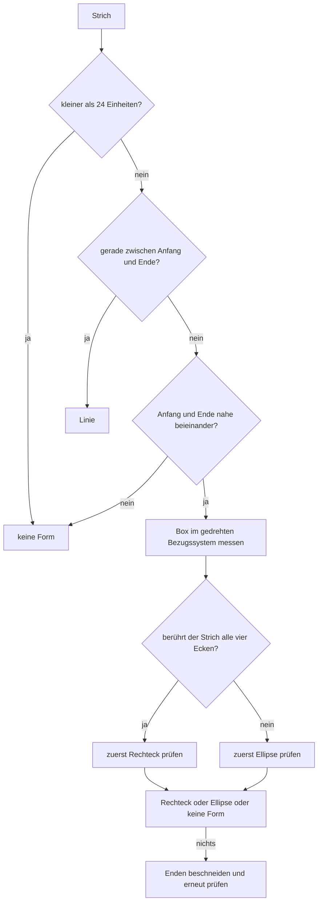

# Lasso und Formen

Zwei Wege, das Geschriebene nach dem Schreiben noch zu ändern: eine Schleife um die Striche ziehen
(**Lasso**) und einen Strich kurz still halten (**Formerkennung**). Beides fasst dieselben Striche an,
beides schreibt nur, wo die Tinte eines Strichs liegt — und beides ist **ein** Schritt in der
Historie, also mit einem Rückgängig wieder weg.

## Lassowerkzeug

| Ort | Verhalten |
| --- | --- |
| Leiste → Lassoknopf (`LassoButton`, `CardInkEditorPage.xaml:63`) | Macht das Lasso zum Werkzeug. Es bleibt, bis ein anderes Werkzeug gewählt wird. |
| Schleife ziehen | Alle Striche, die **ganz** in der Schleife liegen, werden aufgenommen und blau umrahmt. Ein Strich, der die Schleife nur durchquert, gehört nicht dazu. |
| Auf der Auswahl ziehen | Trägt die ganze Gruppe; wo sie losgelassen wird, steht sie. |
| Auf eine leere Stelle tippen/ziehen | Zeichnet eine neue Schleife, die alte Auswahl fällt weg. |
| Papierkorb im Werkzeug (`SelectionDeleteButton`) | Steht nur, solange etwas aufgenommen ist, und wirft die Auswahl weg. |
| Stift-Taste (**Windows**) | So lange der Knopf am Stift gedrückt ist, ist das Lasso im Einsatz; loslassen bringt das vorherige Werkzeug zurück. |
| Stift-Doppeltipp und -Drücken (**iOS**) | Folgt der iOS-Einstellung für den Doppeltipp bzw. (Pencil Pro, iOS 17.5+) fürs Drücken. Auf „Vorheriges Werkzeug" gestellt führt der Weg über das Lassowerkzeug, wenn dieses zuletzt in Gebrauch war. |
| Einstellungen → *Zeichnen* | „Stift-Taste halten, um zu markieren" (nur Windows) und „Apple-Pencil-Doppeltipp …" (nur iOS) schalten das ab. |

Die Schleife wird **so gelesen, wie sie gezogen wurde** — sie wird nicht von selbst geschlossen. Wer
sie nicht zubekommt, nimmt nichts auf.

Der Stift-Eingriff schaltet nur das Werkzeug um und nichts sonst: die Schleife, das Tragen und der
Rückgängig-Schritt bleiben der gewöhnliche Lasso-Weg (`PencilTapBehavior.cs`,
`PenButtonLassoBehavior.cs`). Auf Windows kommt das Signal aus WinUI
(`PointerPointProperties.IsBarrelButtonPressed`), in SkiaSharp ist es nicht enthalten; auf iOS aus
`UIPencilInteraction`, weil MAUI dafür keine Schnittstelle hat. Android meldet nichts Vergleichbares —
dort führt nur der Knopf in der Leiste zum Lasso.

Im Quelltext: `SkiaInkCanvasView` (`HandleLassoTouch`, `StrokesInsideLoop`, `IsInsideLoop`,
`SelectionDrag`), das Werkzeug selbst ist `InkTool.Lasso` (`Ink/InkTool.cs`), und die Zeichenfläche
reicht `Tool` und `SelectionCount` über `IInkCanvasView`/`InkCanvasHostView` an die Seite, die daraus
den Papierkorb ein- und ausblendet.

> **Der Ersatz-Renderer kann das nicht.** In den Einstellungen lässt sich die Zeichenfläche auf die
> `DrawingView` aus dem CommunityToolkit umstellen. Diese Fläche hat keinen Zugriff auf die Berührungen,
> während gezeichnet wird — dort wird `Lasso` zwar als Werkzeug gehalten und in der Leiste angezeigt,
> aber es wird nichts aufgenommen (`ToolkitInkCanvasView`, Klassenkommentar). Dasselbe gilt für die
> Formerkennung. Beides setzt die Skia-Fläche voraus, die auch die Voreinstellung ist.

## Formerkennung

| Ort | Verhalten |
| --- | --- |
| Strich zeichnen, dann 700 ms still halten | Der Strich wird zur Form, wenn er eine ist. Es gibt kein eigenes Werkzeug dafür: man zeichnet wie immer und hält danach kurz still. |
| Anschließend weiterschreiben | Bricht das Warten ab, der Strich bleibt, wie er gemalt wurde. |
| Linie | Gerade von Anfang zu Ende, wenn der Strich nicht weit davon abweicht. |
| Rechteck / Quadrat | Wenn der Strich um seine eigene Box herumläuft und alle vier Seiten da sind. Quadrat ist ein Rechteck mit gleicher Breite und Höhe. |
| Kreis / Ellipse | Wenn der Strich um seine Box herumläuft und überall den gleichen Abstand zur Mitte hält; ein Kreis ist die Ellipse mit gleicher Breite und Höhe. |
| Einstellungen → *Zeichnen* → „Linie, Rechteck und Ellipse …" | Schalter, Standard **an**. Aus bleibt das Gezeichnete unangetastet. |
| Rückgängig | Bringt die Handzeichnung in einem Schritt zurück. |

Die Form wird **in denselben Strich geschrieben**: der Strich bleibt derselbe Gegenstand, nur seine
Punkte werden ersetzt (`RecognizeShape` in `SkiaInkCanvasView.cs`; das ist ein
`InkStrokeMove`, kein Radieren-und-Neuschreiben). Deshalb bleiben die Auswahl des Lassos, die Historie
und das Speichern der Notiz unverändert gültig.

### Wie gelesen wird

Gelesen wird gegen die Box, die der Strich bedeckt — nicht gegen eine Idealform aus seinen beiden En­den.
Das ist der Grund, warum ein Kreis, der ein Stück neben seinem Anfang endet, derselbe Kreis bleibt und
eine zittrige Linie dieselbe Linie. `Penban.Recognition/ShapeRecognizer.cs`:

* **Drehen vor dem Messen** (`TightestAngle`): Ein schief gezeichnetes Rechteck hat nur aufgerichtet die
  kleinste Box. Gesucht wird über −45°…+45° in 24 Schritten; die gefundene Form wird anschließend wieder
  zurückgedreht.
* **Ecken-Berührung als Entscheidung zwischen Rechteck und Ellipse** (`TouchesCorners`): Ein Rechteck
  läuft immer in alle vier Ecken seiner Box — auch wenn die Seiten bauchig geraten sind. Eine Ellipse tut
  das nie: ihr nächster Punkt zur Ecke ist ein Fünftel der kürzeren Seite. Gemessen wird der Abstand zur
  **Strecke** zwischen zwei Punkten, nicht zum Punkt selbst, weil schnell gezogene Bogen weite Schritte
  machen.
* **Kurz gehaltene Toleranzen**: Seiten dürfen 14 % der kürzeren Seite von der Box abweichen
  (`EdgeTolerance`), eine Ellipse darf 12 % vom Radius abweichen (`EllipseDeviation`); gerundete Ecken
  bis etwa zwei Fünftel der kürzeren Seite bleiben ein Rechteck. Die Toleranzen sind absichtlich knapp:
  aus einem gemalten Strich eine Form zu machen, die er nicht war, ist der einzige Fehler, den man nicht
  übermalen kann.
* **Beschneiden am Ende** (`TrimShare`): Wer ein Rechteck über die Ecke hinaus weiterzieht, bedeckt eine
  größere Box und wird sonst nicht mehr erkannt. Deshalb werden zum Schluss die Enden stückweise
  abgeschnitten und erneut geprüft.

### Grenzen

| Zeichnung | Wird gelesen als |
| --- | --- |
| Sehr rundes Rechteck (Eckenradius ab etwa der halben kurzen Seite) und Stadion | **Ellipse** — mit so runden Ecken ist der Unterschied zur Ellipse nicht mehr da. |
| Ziffer „8", Buchstabe „o", kleines „O" | **Ellipse**, wenn sie groß genug sind. |
| Spirale, Ellipse mit Schwanz | **Ellipse** (der Halbmesser-Test `EllipseMaxRadius` fängt nur die größten Ausreißer). |
| Strich unter 24 Einheiten | **keine Form** — das ist ein Wackler beim Schreiben, keine Absicht. |
| „C", „U", Dreieck | **keine Form**. Ein Dreieck hat drei Seiten und drei Ecken; dafür gibt es keine eigene Form. |
| Rechteck, dessen Seite nachgefahren wurde; „8" aus zwei Runden | **keine Form** bzw. Ellipse — bewusst lieber nichts als etwas Falsches. |

Nicht gebaut: das **Ziehen nach dem Halten** („hold & drag to resize", Karte 1 des Feedback-Boards).
Nach dem Halten ist die Form fertig; sie lässt sich über das Lasso aufnehmen und verschieben.

## Einstellungen und Schlüssel

| Schalter | Schlüssel | Standard | Plattform |
| --- | --- | --- | --- |
| Linie, Rechteck und Ellipse nach kurzem Halten begradigen | `Draw.ShapeRecognitionEnabled` | an | alle |
| Stift-Taste halten, um zu markieren | `Draw.PenButtonLassoEnabled` | an | Windows |
| Apple-Pencil-Doppeltipp wechselt zum Radiergummi | `Draw.PencilDoubleTapEnabled` | an | iOS |

Die Formerkennung gilt für Stift und Finger gleichermaßen; das Lasso wird nur über den Knopf in der
Leiste gewählt, die Tastengriffe des Stifts sind der kurze Weg dahin.
