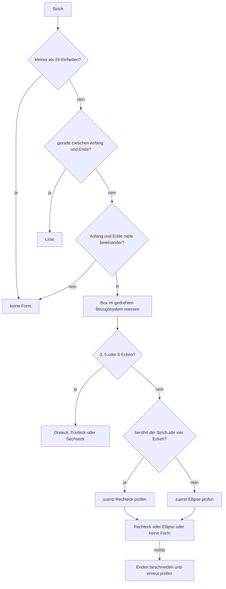

# Lasso und Formen

Zwei Wege, das Geschriebene nach dem Schreiben noch zu ändern: eine Schleife um die Striche ziehen
(**Lasso**) und den Stift auf einem Strich kurz still halten (**Formerkennung**). Beides fasst dieselben
Striche an, beides schreibt nur, wo die Tinte eines Strichs liegt — und beides ist **ein** Schritt in der
Historie, also mit einem Rückgängig wieder weg.

## Lassowerkzeug

| Ort | Verhalten |
| --- | --- |
| Leiste → Lassoknopf (`LassoButton`, `CardInkEditorPage.xaml:63`) | Macht das Lasso zum Werkzeug. Es bleibt, bis ein anderes Werkzeug gewählt wird. |
| Schleife ziehen | Alle Striche, die **ganz** in der Schleife liegen, werden aufgenommen und blau umrahmt. Ein Strich, der die Schleife nur durchquert, gehört nicht dazu. |
| Auf der Auswahl ziehen | Trägt die ganze Gruppe; wo sie losgelassen wird, steht sie. Das gilt für **jedes** Werkzeug: solange etwas aufgenommen ist, trägt die Stiftspitze die Gruppe auch dann, wenn in der Hand längst wieder der Stift ist — siehe unten. |
| Auf eine leere Stelle tippen | Legt die Auswahl ab — und zeichnet dabei nichts: der Tipp, mit dem man die Schleife schliesst, hinterlässt keinen Punkt. |
| Auf eine leere Stelle ziehen | Legt die Auswahl erst ab und zeichnet dann. Mit dem Lasso in der Hand beginnt hier die nächste Schleife, mit dem Stift ein neuer Strich (oder der Radierer) — beides erst, nachdem die Gruppe abgelegt ist, also ohne sie mitzunehmen. |
| Papierkorb im Werkzeug (`SelectionDeleteButton`) | Steht nur, solange etwas aufgenommen ist, und wirft die Auswahl weg. |
| Lassoknopf noch einmal | Legt die Auswahl ab und nimmt das Lasso weg: der Knopf, der die Gruppe aufgenommen hat, lässt sie auch wieder los. |
| Stift-Taste (**Windows**) | So lange der Knopf am Stift gedrückt ist, ist das Lasso im Einsatz; loslassen bringt das vorherige Werkzeug zurück. Eine aufgenommene Gruppe bleibt dabei aufgenommen und wird von der Stiftspitze weitergetragen. |
| Stift-Doppeltipp und -Drücken (**iOS**) | Entscheidet nur, **welches** Werkzeug im Einsatz ist — gezeichnet und die Schleife gezogen wird mit der Stiftspitze. Die App folgt dabei der iOS-Einstellung für den Doppeltipp (und beim Pencil Pro ab iOS 17.5 fürs Drücken): „Zum Radiergummi wechseln" (der iOS-Standard) schaltet Radierer ⇄ Stift, „Vorheriges Werkzeug" nimmt das zuletzt benutzte — nur so wird das Lasso mit dem Stift erreichbar. Siehe unten. |
| Einstellungen → *Zeichnen* | „Stift-Taste halten, um zu markieren" (nur Windows) und „Apple-Pencil-Doppeltipp und -Drücken folgen der iOS-Einstellung" (nur iOS) schalten das ab. |

Die Schleife wird **so gelesen, wie sie gezogen wurde** — sie wird nicht von selbst geschlossen. Wer
sie nicht zubekommt, nimmt nichts auf.

Der Stift-Eingriff schaltet nur das Werkzeug um und nichts sonst: die Schleife, das Tragen und der
Rückgängig-Schritt bleiben der gewöhnliche Lasso-Weg (`PencilTapBehavior.cs`,
`PenButtonLassoBehavior.cs`). Auf Windows kommt das Signal aus WinUI
(`PointerPointProperties.IsBarrelButtonPressed`), in SkiaSharp ist es nicht enthalten; auf iOS aus
`UIPencilInteraction`, weil MAUI dafür keine Schnittstelle hat. Android meldet nichts Vergleichbares —
dort führt nur der Knopf in der Leiste zum Lasso.

**Wer etwas aufgenommen hat, trägt es mit der Spitze — unabhängig davon, welches Werkzeug in der Hand
ist.** Der Knopf am Stift hält das Lasso nur, solange er gedrückt ist; danach ist wieder der Stift das
Werkzeug, die Gruppe aber noch aufgenommen. Ein Kontakt auf der Gruppe zieht sie deshalb auch dann,
wenn eigentlich gezeichnet würde, und ein Kontakt daneben legt sie ab, bevor er zeichnet oder radiert
(`HandlePickedUpTouch`). Ohne das wäre eine aufgenommene Gruppe mit dem Stift nicht mehr zu erreichen:
jeder Strich daneben bliebe stehen und jeder Strich darauf wäre ein neuer Strich, statt die Gruppe
dorthin zu tragen, wo sie hingehört. Mit dem Finger gilt das nur, wenn das Zeichnen mit dem Finger an
ist — ein Finger, der scrollt, hat auf der Notiz nichts zu sagen.

Der Preis dafür: ein Strich, der **auf** der Gruppe begonnen wird, zieht die Gruppe, statt zu zeichnen.
Wer auf einer aufgenommenen Gruppe schreiben will, legt sie vorher ab — mit einem Tipp daneben oder mit
dem Lassoknopf.

**Der Tipp, der die Schleife schliesst, zeichnet nicht.** Das Lasso wird meist *nicht* von der Spitze
geführt, sondern vom Knopf am Stift (Windows) oder vom Doppeltipp (iOS) — das Werkzeug fällt also
genau in dem Moment zurück, in dem man die Schleife mit einem Tipp daneben schliesst. Mit dem Stift in
der Hand wäre dieser Tipp der Anfang eines neuen Strichs und bliebe als Punkt stehen. Deshalb merkt
sich der Kontakt, der auf eine aufgenommene Gruppe trifft, sein Kennzeichen
(`putDownContactId` in `SkiaInkCanvasView.cs`), und der Strich, den er beginnt, wird beim Loslassen
wieder verworfen, solange der Kontakt nicht weiter als `PutDownSlop` (6 px) gewandert ist
(`DropPutDownTap` → `DropCurrentStroke`). Erst ein **Zug** daneben legt ab und zeichnet wirklich. Weil
der verworfene Strich auch aus der Historie genommen wird, sieht Rückgängig nichts davon. Damit die
Schleife dabei nicht verlorengeht, liest `PenButtonLassoBehavior.EndSelection` sie mit
`FinishLasso()` aus, **bevor** es das vorherige Werkzeug zurücksetzt — sonst hätte der Tipp danach
kein Lasso mehr vor sich und der nächste Kontakt würde nur noch zeichnen.

**Die Auswahl hält nur fest, was noch da ist.** Wird ein aufgenommener Strich wegradiert (oder die ganze
Notiz geleert, oder etwas rückgängig gemacht), verschwindet er auch aus der Auswahl
(`PruneSelection` in `SkiaInkCanvasView.cs`). Sonst bliebe der blaue Rahmen um Striche stehen, die es
nicht mehr gibt, und der nächste Kontakt **in** diesem Rahmen würde zu einem Zug auf eine Gruppe, die
keinen Strich mehr enthält: ein Schritt in der Historie, der nichts tut. Genau daran hat sich der
Rückgängig-Stapel verschoben — ein Rückgängig ohne Wirkung, das nächste brachte längst wegradierte
Striche zurück. Aus demselben Grund schreibt `InkCommandStack` einen Zug nur noch für Striche, die
wirklich in der Gruppe liegen.

### Was der Doppeltipp auf iOS wirklich tut

Der Doppeltipp ist **kein zweiter Weg zum Radiergummi**, den die App mit dem Lasso teilen müsste — er
ist der Griff, mit dem iOS **ein** Werkzeug auswählen lässt. Apple erwartet, dass eine App das befolgt,
was der Benutzer dort eingestellt hat; deshalb liest `PencilTapBehavior` bei jedem Tipp
`UIPencilInteraction.PreferredTapAction` (beim Pencil Pro ab iOS 17.5 beim Drücken
`PreferredSqueezeAction`) und setzt um, was dort steht:

| iOS-Einstellung | Was die App tut |
| --- | --- |
| „Zum Radiergummi wechseln" (**Standard**) | Radierer ⇄ Stift. Das ist die Belegung, die die meisten Pencils haben, und sie bleibt unangetastet. |
| „Vorheriges Werkzeug" | Zurück zum zuletzt benutzten Werkzeug, hin und her — damit lässt sich zwischen Stift und Lasso umschalten, wenn das Lasso vorher mit dem Knopf gewählt wurde. |
| „Farbpalette anzeigen", „Stiftattribute anzeigen" | Nichts: eine Notiz hat keine solche Palette, und ein zweites Farbmenü neben der Leiste wäre nur verwirrend. |
| „Aus" | Nichts. |

Der Knopf in der Leiste ist deshalb der normale Weg zum Lasso: man tippt ihn, wählt damit das
Werkzeug und zieht die Schleife mit dem Stiftspitzen-Ende. Der Doppeltipp hilft nur, das Lasso wieder
wegzubekommen, ohne die Hand zur Leiste zu führen. Auf einem Pencil **Pro** gibt es beide Griffe
getrennt — Doppeltipp auf Radiergummi *und* Drücken auf „Vorheriges Werkzeug" — auf einem Pencil 2 nur
den Doppeltipp.

Im Quelltext: `SkiaInkCanvasView` (`HandleLassoTouch`, `HandlePickedUpTouch`, `StrokesInsideLoop`,
`IsInsideLoop`, `SelectionDrag`), das Werkzeug selbst ist `InkTool.Lasso` (`Ink/InkTool.cs`), und die
Zeichenfläche reicht `Tool`, `SelectionCount` und `ClearSelection` über
`IInkCanvasView`/`InkCanvasHostView` an die Seite, die daraus den Papierkorb ein- und ausblendet.

> **Der Ersatz-Renderer kann das nicht.** In den Einstellungen lässt sich die Zeichenfläche auf die
> `DrawingView` aus dem CommunityToolkit umstellen. Diese Fläche hat keinen Zugriff auf die Berührungen,
> während gezeichnet wird — dort wird `Lasso` zwar als Werkzeug gehalten und in der Leiste angezeigt,
> aber es wird nichts aufgenommen (`ToolkitInkCanvasView`, Klassenkommentar). Dasselbe gilt für die
> Formerkennung. Beides setzt die Skia-Fläche voraus, die auch die Voreinstellung ist.

## Formerkennung

| Ort | Verhalten |
| --- | --- |
| Strich zeichnen, dann den Stift 700 ms still halten — **ohne ihn abzuheben** | Der Strich wird zur Form, wenn er eine ist. Es gibt kein eigenes Werkzeug dafür: man zeichnet wie immer und hält am Ende kurz still. |
| Den Stift dabei weiterbewegen | Startet die Wartezeit neu. Ein „o" oder eine „8" wird nie zur Form, weil der Stift dabei nie still steht. |
| Nach dem Erkennen den Stift weiterbewegen | Die Form wird **gezogen**: sie wächst und schrumpft mit dem Stift, siehe *Ziehen nach dem Erkennen*. |
| Stift abheben | Die Form steht. In der Historie ist das **ein** Schritt. |
| Linie | Gerade von Anfang zu Ende, wenn der Strich nicht weit davon abweicht. |
| Rechteck / Quadrat | Wenn der Strich um seine eigene Box herumläuft und alle vier Seiten da sind. Quadrat ist ein Rechteck mit gleicher Breite und Höhe. |
| Dreieck / Fünfeck / Sechseck | Wenn der Strich um seine Box herumläuft, alle Seiten da sind und es an **jeder** Ecke wirklich um die Ecke geht. Für die Chemie: Dreieck, Fünfeck und Sechseck sind die Ringe, aus denen die meisten Moleküle gezeichnet werden. |
| Kreis / Ellipse | Wenn der Strich um seine Box herumläuft und überall den gleichen Abstand zur Mitte hält; ein Kreis ist die Ellipse mit gleicher Breite und Höhe. |
| Einstellungen → *Zeichnen* → „Linie, Rechteck und Ellipse …" | Schalter, Standard **an**. Aus bleibt das Gezeichnete unangetastet. |
| Rückgängig | Bringt die Handzeichnung in einem Schritt zurück; ein zweites Mal nimmt den Strich ganz weg. |

Die Form wird **in denselben Strich geschrieben**: der Strich bleibt derselbe Gegenstand, nur seine
Punkte werden ersetzt (`RecognizeShape` in `SkiaInkCanvasView.cs`). Deshalb bleiben die Auswahl des
Lassos, die Historie und das Speichern der Notiz unverändert gültig. Solange der Stift unten ist, steht
die Form als **Entwurf** (`ShapeDraft`) da: was gezogen wird, ist noch nicht in der Historie, und erst
das Abheben des Stifts schreibt **einen** `InkStrokeMove` von der Handzeichnung zur fertigen Form.

### Ziehen nach dem Erkennen

Der Stift ist nach dem Erkennen noch unten — also zieht er die Form, statt weiterzuschreiben.

| Form | Was der Stift tut |
| --- | --- |
| Linie | Der zweite Punkt folgt dem Stift; der Anfang bleibt stehen. Die Linie lässt sich damit in einem Zug drehen und strecken. |
| Rechteck, Dreieck, Vieleck, Kreis / Ellipse | Gezogen wird um die Ecke der Box, die dem Stift beim Erkennen **gegenüber** liegt: die bleibt stehen, der Stift zieht den Rest. Die beiden Richtungen werden **getrennt** skaliert, ein Kreis wird also zur Ellipse, wenn man ihn seitlich zieht. |

* Gerechnet wird **im Bezugssystem der Form**, nicht in dem der Notiz (`RecognizedShape.Angle`): ein
  schiefes Rechteck würde in Notiz-Koordinaten achsenweise skaliert zu einem Parallelogramm verzerrt.
* Der Faktor ergibt sich aus dem Abstand des Stifts zur festen Ecke, verglichen mit dem Abstand beim
  Erkennen (`ShapeResize` in `Penban.Recognition`). An der Stelle, an der erkannt wurde, ist er 1 — es
  passiert also nichts, solange der Stift nicht bewegt wird.
* Gezogen wird zwischen dem 0,15-fachen und dem 20-fachen der erkannten Größe; darüber hinaus folgt die
  Form dem Stift nicht mehr. Eine Form, die man auf null zieht, wäre keine Form mehr, und aus einer
  Linie kommt man nicht mehr heraus.
* Wird der Entwurf aufgegeben — Rückgängig, Radieren, Werkzeugwechsel, ein neuer Strich — geht der Strich
  auf die Handzeichnung zurück. Ein Entwurf, der keine Form mehr ist, ist auch kein Historien-Schritt.

### Wie gelesen wird

Gelesen wird gegen die Box, die der Strich bedeckt — nicht gegen eine Idealform aus seinen beiden En­den.
Das ist der Grund, warum ein Kreis, der ein Stück neben seinem Anfang endet, derselbe Kreis bleibt und
eine zittrige Linie dieselbe Linie. `Penban.Recognition/ShapeRecognizer.cs`:

* **Drehen vor dem Messen** (`TightestAngle`): Ein schief gezeichnetes Rechteck hat nur aufgerichtet die
  kleinste Box. Gesucht wird über −45°…+45° in 24 Schritten; die gefundene Form wird anschließend wieder
  zurückgedreht.
* **Ecken-Berührung als Entscheidung zwischen Rechteck und Ellipse** (`TouchesCorners`): Ein Rechteck
  läuft immer in alle vier Ecken seiner Box — auch wenn die Seiten bauchig geraten sind. Eine Ellipse tut
  das nie: ihr nächster Punkt zur Ecke ist ein Fünftel der kürzeren Seite. Gemessen wird der Abstand zur
  **Strecke** zwischen zwei Punkten, nicht zum Punkt selbst, weil schnell gezogene Bogen weite Schritte
  machen.
* **Kurz gehaltene Toleranzen**: Seiten dürfen 14 % der kürzeren Seite von der Box abweichen
  (`EdgeTolerance`), eine Ellipse darf 12 % vom Radius abweichen (`EllipseDeviation`); gerundete Ecken
  bis etwa zwei Fünftel der kürzeren Seite bleiben ein Rechteck. Die Toleranzen sind absichtlich knapp:
  aus einem gemalten Strich eine Form zu machen, die er nicht war, ist der einzige Fehler, den man nicht
  übermalen kann.
* **Beschneiden am Ende** (`TrimShare`): Wer ein Rechteck über die Ecke hinaus weiterzieht, bedeckt eine
  größere Box und wird sonst nicht mehr erkannt. Deshalb werden zum Schluss die Enden stückweise
  abgeschnitten und erneut geprüft.
* **Vielecke vor der Ellipse** (`TryPolygon`): Die Ecken eines Sechsecks stehen nur etwa ein Siebtel
  seines Halbmessers außerhalb der Ellipse seiner Box — es würde sonst als Ellipse durchgehen. Gesucht
  werden deshalb zuerst 3, 5 oder 6 Ecken: die Punkte werden nach Abstand zur Mitte sortiert und der
  Reihe nach als Ecke genommen, wenn sie weit genug von jeder schon gefundenen entfernt sind
  (`CornerSeparation`). Verlangt wird zusätzlich, dass der Strich an jeder Ecke wirklich um die Ecke
  geht (`CornerSharpness` über `Reached`) und dass **alle** Punkte nahe an einer der Seiten liegen
  (`EdgeTolerance`) — deshalb wird nichts Rundes für einen Ring gehalten. Ein Strich mit vier Ecken wird
  nie ein Vieleck; Rechtecke bleiben unberührt.
* **Genau 3, 5, 6** (`PolygonSides`): Sieben- und Achtecke werden nicht gezählt und bleiben eine Ellipse.
  Lieber nichts als etwas Falsches.

### Grenzen

| Zeichnung | Wird gelesen als |
| --- | --- |
| Sehr rundes Rechteck (Eckenradius ab etwa der halben kurzen Seite) und Stadion | **Ellipse** — mit so runden Ecken ist der Unterschied zur Ellipse nicht mehr da. |
| Sehr rundes Sechseck (Eckenradius ab etwa einem Viertel des Halbmessers) | **Fünfeck** oder **Ellipse** — die Ecken sind dann keine Ecken mehr. |
| Ziffer „8", Buchstabe „o", kleines „O" | **Ellipse**, wenn sie groß genug sind. |
| Spirale, Ellipse mit Schwanz, Sechseck mit Schwanz | **Ellipse** (der Halbmesser-Test `EllipseMaxRadius` fängt nur die größten Ausreißer). |
| Strich unter 24 Einheiten | **keine Form** — das ist ein Wackler beim Schreiben, keine Absicht. |
| „C", „U", offenes Dreieck | **keine Form**. Ein offener Ring ist keine der Formen, die es gibt. |
| Sieben- und Achteck | **Ellipse** — gezählt werden nur 3, 5 und 6 Ecken. |
| Rechteck, dessen Seite nachgefahren wurde | **keine Form** — bewusst lieber nichts als etwas Falsches. |

Nicht gebaut: eine Form nach dem Erkennen **am Griff** zu drehen, und Formen als Objekte zu behalten
(also später noch einmal ziehen zu können). Nach dem Abheben des Stifts ist die Form fertig; sie lässt
sich über das Lasso aufnehmen und verschieben.

## Einstellungen und Schlüssel

| Schalter | Schlüssel | Standard | Plattform |
| --- | --- | --- | --- |
| Linie, Rechteck und Ellipse nach kurzem Halten begradigen | `Draw.ShapeRecognitionEnabled` | an | alle |
| Stift-Taste halten, um zu markieren | `Draw.PenButtonLassoEnabled` | an | Windows |
| Apple-Pencil-Doppeltipp und -Drücken folgen der iOS-Einstellung | `Draw.PencilDoubleTapEnabled` | an | iOS |

Alle drei Reihen in den Einstellungen hängen an der Plattform, deren Stift sie beschreiben: der
Stiftknopf ist eine Windows-Sache, der Doppeltipp eine iOS-Sache — auf den anderen Plattformen steht
die Reihe gar nicht erst da. `Draw.PencilDoubleTapEnabled` schaltet den Stift **nicht** auf Radierer
fest, sondern nur, ob die App befolgt, was in iOS eingestellt ist (siehe
„Was der Doppeltipp auf iOS wirklich tut").

Die Formerkennung gilt für Stift und Finger gleichermaßen; das Lasso wird mit dem Knopf in der Leiste
gewählt, die Griffe des Stifts sind der kurze Weg dorthin.
