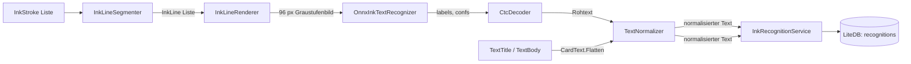

# Texterkennung in Notizen

Penban liest die Handschrift auf den Karten ("Notizen") und macht ihren Text durchsuchbar. Alles
läuft auf dem Gerät, ohne Netz und ohne Konto. Es ist keine Transkription: die Erkennung existiert
allein, damit man eine Notiz wiederfindet, die man vor Wochen geschrieben hat.

Eine Notiz kann auch **getippt** sein (siehe [docs/textfeld-notizen.md](textfeld-notizen.md)). Was
getippt wurde, braucht die Erkennung nicht: es liegt schon als Text vor, wird beim Speichern nur
normalisiert und ist damit sofort durchsuchbar. Beide Sorten liegen in derselben Zeile je Karte und
werden von derselben Suche gefunden — dieser Text beschreibt ab dem folgenden Abschnitt die
Handschrift, der getippte Weg steht unter [Zwei Eingänge](#zwei-eingänge).

## Was der Benutzer sieht

| Ort | Verhalten |
| --- | --- |
| Einstellungen → **Suche** → *Text in Notizen finden* | Schalter, Standard **an**. Aus schaltet die Erkennung vollständig ab. |
| Einstellungen → *Vorhandene Notizen lesen* → **Jetzt lesen** | Liest alle Notizen auf einmal nach, mit Fortschritt (`{0} von {1} Notizen gelesen`) und Ergebnis (`{0} Notizen sind jetzt durchsuchbar.`). |
| Lupe in der Board-Übersicht | Suchseite. Gesucht wird auf der Suchtaste, nicht bei jedem Buchstaben: eine Suche liest den ganzen Bestand, und der Text einer Notiz liegt erst vor, wenn sie gelesen wurde. |
| Suchtreffer | Zeigt die Notiz selbst (Tinte, in ihrer Papierfarbe), den gelesenen Text und das Board. Ein Tipp öffnet das Board und darin die Notiz im Ink-Editor. Bei einer getippten Notiz steht dort **Getippt** statt *Gelesen*, und eine Textkarte ohne Tinte zeigt ihre ersten Zeilen statt eines leeren Blattes. |
| Suchseite, noch offene Arbeit | `Notizen werden noch gelesen ({0} ausstehend)` — sonst hielte man „noch nicht gelesen" für „nicht vorhanden". Getippte Notizen zählen nicht mit: an ihnen gibt es nichts zu lesen. |
| Fehler | Werden als Dialog gemeldet, statt die App zu beenden. |

Gelesen wird beim Speichern einer Notiz und beim Öffnen ihres Boards, im Hintergrund. Ein ganzes
Board braucht beim ersten Mal einige Minuten.

## Aufbau



Der Weg über `B`–`E` ist die Handschrift; die getippte Notiz (`T`) steigt beim `TextNormalizer` ein
und überspringt Segmentierung, Rasterung und Modell. Beide Wege enden in derselben Zeile je Karte,
und keiner überschreibt den anderen — eine Notiz, auf der beides steht, bleibt auf beiden Wegen
findbar.

1. **`InkLineSegmenter`** — gruppiert die Striche einer Karte zu Textzeilen, von oben nach unten.
   Rein geometrisch, weil das Modell ein *Zeilen*modell ist und keine eigene Layouterkennung hat:
   eine Zeile zu finden ist vollständig Aufgabe dieser Klasse. Verfahren: Tinte bei
   Dokumentauflösung rastern, Tintenpixel pro Zeile zählen, maximale Tintenläufe ("Bänder")
   schneiden, kurze Bänder (i-Punkte, Punkte, Akzente) in das nächstgelegene hohe Band verschieben,
   ein zu hohes Band am tiefsten inneren Tal teilen, jeden Strich dem Band zuordnen, das er am
   stärksten überlappt, und Bänder mit weniger als zwei Strichen verwerfen.
2. **`InkLineRenderer`** — zeichnet eine Zeile in das Graustufenbild, das das Modell liest. Das Bild
   ist nicht auf die Eingabehöhe skaliert, sondern so, dass die *Tinte* einen festen Anteil dieser
   Höhe bedeckt (Füllverhältnis). Gerendert wird bei 3-facher Größe und dann mit Lanczos
   heruntergefiltert; der Rasterer setzt harte Pixel, weil ein Strich eine Form und kein Verlauf ist.
3. **`OnnxInkTextRecognizer`** + **`CtcDecoder`** — ONNX-Inferenz. Softmax und Argmax liegen im
   Graphen, der Dekoder macht nur noch den CTC-Kollaps (aufeinanderfolgende Duplikate verwerfen,
   dann Label 0 = Blank verwerfen).
4. **`TextNormalizer`** — NFC, dann FormD, Marken auf lateinischen und griechischen Grundbuchstaben
   entfernen, optisch verwechselbare kyrillische und griechische Homoglyphen zusammenfalten,
   `ß`/`β`/`ϐ` → `ss`, Leerraum zusammenziehen. Nie `null`.
5. **`InkRecognitionService`** — Hash über die Striche (`InkHash`) plus `RecognizerProfile` als
   Cache-Schlüssel; bei Treffer wird das gespeicherte Ergebnis zurückgegeben, sonst erkannt und
   abgelegt. Standardgrenze für Suchergebnisse: `DefaultSearchLimit = 50`.
6. **`LiteDbRecognitionStore`** — Sammlung `recognitions` in derselben LiteDB wie Boards und Karten.

Die Reihenfolge ist fest: `RecognitionQueue` liest immer genau eine Karte auf einem einzigen
Hintergrund-Arbeiter, die zuletzt eingereihte zuerst. Erkennung ist CPU-gebunden und der Erkenner
verteilt eine Zeile schon über alle Kerne; mehrere Karten parallel würden dieselben Kerne teilen
statt mehr zu nutzen — und dabei mit dem Zeichnen des Benutzers konkurrieren.

## Zwei Eingänge

Eine Karte hat **eine** Zeile in `recognitions` (`RecognitionRow`), und darin liegen zwei Texte
nebeneinander: `RawText`/`NormalizedText` aus der Handschrift und `TypedText`/`NormalizedTypedText`
aus der Tastatur. Sie überschreiben sich nicht, und `SearchAsync` vergleicht beide Spalten in
demselben Durchlauf. Beides in eine Spalte zu schreiben wäre billiger gewesen, hätte aber jedes Mal
einen der beiden Texte gelöscht: wer eine getippte Notiz mit dem Stift ergänzt, soll beides
wiederfinden.

**Der getippte Weg kommt ohne Modell aus.** `CardService.SaveCardAsync` schreibt den getippten Text
bei **jedem** Speichern, leer oder nicht — so verlässt Text, den der Benutzer gelöscht hat, die Suche
zusammen mit der Karte, die er gelöscht hat. Normalisiert wird er mit demselben `TextNormalizer` wie
der gelesene (gleiche Unicode-Form, gleiche Homoglyphen, gleiches `ß`/`β` → `ss`), damit eine Suche
nicht davon abhängt, ob das Wort getippt oder geschrieben wurde.

**Ob überhaupt gelesen wird, entscheidet `NeedsReading`:** eine Karte wird eingereiht, wenn sie
Tinte trägt **oder** im Stiftmodus steht. Eine Karte im Stiftmodus wird also auch leer eingereiht —
das ist der Weg, wie die Erkennung den Text einer *wegradierten* Notiz wieder aus dem Bestand nimmt.
Eine Karte, die getippt wurde und keine Tinte trägt, hat dagegen nichts zu lesen und wird ausgelassen;
ohne diese Ausnahme stünde jede Textnotiz in der Suche als „wird noch gelesen".

**Woher ein Treffer kam** entscheidet der Vergleich der gespeicherten Formen: enthält die
normalisierte Abfrage die Zeile `NormalizedTypedText`, ist es der getippte Text (Kennzeichen
*Getippt*), sonst der gelesene (*Gelesen*). Der Treffertext selbst wird in der Form angezeigt, in der
er getippt wurde.

## Projekte

| Projekt | Inhalt |
| --- | --- |
| `Penban.Recognition` | Segmentierung, Rasterisierung, Zeilenrenderer, Normalisierung, Dienst und die Schnittstellen (`IInkTextRecognizer`, `IRecognitionStore`, `IInkRecognitionService`). Plattformneutral, ohne MAUI. |
| `Penban.Recognition.Onnx` | ONNX-Inferenz, CTC-Dekoder, Modellkatalog. Referenziert `Microsoft.ML.OnnxRuntime`. |
| `Penban.Services` | `RecognitionQueue` — die Warteschlange; `CardService` — schreibt den getippten Text (ohne Modell und ohne Warteschlange) und entscheidet über `NeedsReading`, was überhaupt gelesen wird. |
| `Penban.Data` | `LiteDbRecognitionStore`, `RecognitionRow`. |
| `Penban.ViewModels` | `SearchViewModel`, `SearchResultViewModel`, Einstellungen. |
| `Penban.Maui.Views` | `SearchPage`, Aufrufe aus Board- und Einstellungsseite. |

## Das Modell

Familie: **kraken PP-OCRv6** Zeilen-Erkenner (CTC), Herkunft
`small-models-for-glam/kraken-ppocrv6-{tiny,small,medium}` auf HuggingFace.

Ausgeliefert wird `kraken-ppocrv6-small-fp16`:

| | |
| --- | --- |
| Datei | `Penban/Penban.Recognition.Onnx/Assets/ppocrv6-small-fp16.onnx` |
| Größe | 7 303 830 Bytes |
| sha256 | `bcce24dd16a3b8b4e1a121a51da77b68f69e8a01f231943db5d340ceaa76cc80` |
| Eingabe | `image`, NCHW, `(N, 3, 96, W)` float32, dynamische Breite |
| Vorverarbeitung | RGB → Lanczos auf Höhe 96 (Breite proportional) → 16 px weiß links und rechts → `/255` → invertieren |
| Ausgabe | `labels` int64 `(N, T)`, `confs` float32 `(N, T)`, `T = W/8` |
| Codec | 1623 Klassen; Label 0 = Blank, Label 1 = Leerzeichen; über **alle** Varianten identisch |
| Lizenz | Apache-2.0 laut Modellkarte — **vor Auslieferung prüfen** |

Modell und Katalog liegen als `EmbeddedResource` **in der Assembly**, nicht in `Resources/Raw` des
MAUI-Kopfprojekts. Dadurch funktioniert der Erkenner ohne MAUI und ohne `FileSystem` und lässt sich
aus einem einfachen Konsolenprogramm heraus betreiben. Die logischen Namen sind festgenagelt, damit
ein Verschieben der Dateien die Suche nicht still verändert.

`ppocrv6-catalog.json` ist gleichzeitig die Vorlage für ein Manifest pro Modell: **Katalog ohne
`variants`, plus genau ein Eintrag aus `variants[*].models`.** Der Codec-Abschnitt bleibt in jedem
Fall gleich.

### Warum small/fp16 und warum r81

Gemessen in einem Benchmark (Phase 0), der nicht Teil dieses Repositories ist. Sauberer Konsens
über fp32/fp16, deutsche Stichprobe:

| Modell | Render | CER | Konfidenz | leere Zeilen |
| --- | --- | --- | --- | --- |
| medium-fp32 | r81 | 0.0684 | 0.883 | 5 |
| medium-fp16 | r81 | 0.0687 | 0.881 | 5 |
| **small-fp16** | **r81** | **0.0707** | **0.864** | **6** ← ausgeliefert |
| small-fp32 | r100 | 0.0709 | 0.852 | 8 |
| small-fp32 | r81 | 0.0741 | 0.861 | 7 |
| small-fp16 | r100 | 0.0757 | 0.852 | 8 |
| medium-fp32 | r50 | 0.0789 | 0.855 | 8 |
| small-int8 | r81 | 0.0849 | 0.835 | 12 |
| tiny-fp16 | r81 | 0.1041 | 0.829 | 9 |
| tiny-fp32 | r81 | 0.1061 | 0.827 | 9 |
| small-fp16 | r50 | 0.1229 | 0.833 | 10 |
| medium-int8 | r81 | 0.3888 | 0.581 | 39 |
| medium-int8 | r100 | 0.4766 | 0.515 | 46 |

Drei Ergebnisse, die die Auswahl bestimmen:

- **`r81` ist richtig, `r50` ist für jede Modellgröße das schlechteste Rendering.** Die 50 %
  Tintenfüllung, auf der die Modelle validiert wurden, passt nicht zu echter Handschrift. Das
  Füllverhältnis ist deshalb Teil der Identität des Erkenners (`RecognizerProfile`) und steckt im
  Cache-Schlüssel: eine Änderung würde sonst jeden zwischengespeicherten Text gültig aussehen
  lassen, obwohl er falsch wäre.
- **Die Reihenfolge medium > small > tiny ist stabil**, aber small-fp16 kostet gegenüber medium-fp32
  nur 0.0023 CER und ist **9× kleiner**. Bei 65 MB für medium ist das für eine App der Unterschied,
  den niemand bemerkt — außer an der Downloadgröße.
- **int8 ist nicht brauchbar.** `medium-int8` gibt für die deutsche Stichprobe **nichts** aus (CER
  0.3888, 39 von 354 Zeilen leer), und keine Quantisierungseinstellung rettet das. `small-int8`
  liegt mit 0.0849 CER über fp16 und liefert 12 statt 6 leere Zeilen.

### Segmentierung auf echter Tinte

Gemessen am echten Bestand des Autors (38 Karten, 2274 Striche), gleicher Erkenner
(`ppocrv6-small-fp16`, `r81`):

| Variante | Zeilen | Konf > 0.8 | Zeichen > 0.8 | Konf > 0.95 | Zeichen > 0.95 | Konf < 0.5 | leer | Ø Konfidenz |
| --- | --- | --- | --- | --- | --- | --- | --- | --- |
| ausgeliefert | 118 | 103 | 1987 | 54 | 1144 | 12 | 6 | 0.864 |
| Labor v2 | 138 | 113 | 2044 | 60 | 1134 | 21 | 19 | 0.801 |

Strukturell: ausgeliefert 118 Zeilen / 31 verworfene Striche / 0 Ein-Strich-Zeilen; Labor v2 138 / 56
/ 11. Die Laborvariante gewinnt auf schrägen und gemischten Karten, zahlt aber mit **+27 % schwachen
Zeilen** (12 → 21) und **+217 % leeren Zeilen** (6 → 19). Für eine Suche sind Mülltreffer schlimmer
als fehlende Treffer, deshalb ist die ausgelieferte Segmentierung geblieben.

Bekanntes Verhalten der Segmentierung: freistehende Zeichnungen und mehrspaltige Skizzen werden zu
mehreren „Zeilen". Große Überschriften (`Board lags`, `Redo`) werden dagegen richtig gelesen — ein
Filter auf „zu hoch" wäre also falsch.

## Ein Modell austauschen

1. Kraken-Modell nach ONNX konvertieren. Der Graph muss Softmax und Argmax enthalten und `labels`
   (int64) sowie `confs` (float32) ausgeben; der Dekoder erwartet genau das.
2. Prüfen, dass die Ausgaben für die Referenztexte der Variante stimmen (`textMatchVsReference` im
   Katalog, 4/4 bei fp32/fp16).
3. Manifest anlegen: Katalog ohne `variants`, plus den gewählten Eintrag aus
   `variants[*].models`, mit `id`, `sizeBytes` und `sha256`.
4. Beide Dateien als `EmbeddedResource` mit festen `LogicalName`-Werten einbinden.
5. **`RecognizerProfile` anpassen**, wenn sich Modell, Füllverhältnis oder Unicode-Form ändern —
   sonst wird alter, unter anderen Bedingungen erzeugter Text als gültig behandelt.
6. Gegen den echten Bestand messen, nicht gegen die Referenztexte: die Referenztexte prüfen die
   Konvertierung, nicht die Brauchbarkeit.

## Die Suche

`LiteDbRecognitionStore.SearchAsync` vergleicht **im Speicher**: `FindAll()` → `Contains` →
`OrderByDescending(UpdatedAtUtc)` → `Take(limit)` → `ToStored()`. Grund: LiteDB übersetzt `Contains`
in ein `LIKE` ohne Escaping, in dem `%` auf jede Zeile passt und `a_b` auch `axb` findet. Ein
`LIKE` über den Bestand wäre also nicht nur langsam, sondern falsch.

**Fallstrick, der die App einmal zum Absturz brachte:** LiteDB 5.0.21 legt `string.Empty` als BSON
`Null` ab und liest es als `null` zurück. Jede Notiz, auf der die Erkennung keinen Text gefunden hat
(Kritzeleien, ein einzelner Punkt, Notizen, deren Zeilen alle leer dekodieren), liegt also mit
`null`-Text in der Datenbank. Im echten Bestand waren 4 von 43 Zeilen so. Die Suche war die einzige
Stelle, die die rohe Zeile dereferenziert, weil sie die Zeilen vergleicht, **bevor** sie auf
`StoredRecognition` abgebildet werden. Deshalb wird an drei Stellen abgesichert:

1. `LiteDbRecognitionStore.SearchAsync` prüft `row.NormalizedText is not null` im Prädikat.
2. `RecognitionRow.ToStored()` faltet `null` auf `string.Empty` zurück.
3. `SearchViewModel.SearchAsync` fängt Ausnahmen und meldet sie, weil ein werfendes
   `AsyncRelayCommand` die App beendet.

## Bekannte Grenzen

- **Die Notiz eines Boards wird nicht gelesen** (`Board.NoteStrokes`), nur die Karten darauf.
- **Eine getippte Notiz wird nicht gelesen** — bei ihr gibt es nichts zu lesen. Sie steht deshalb nie
  in der Warteschlange und zählt bei *Vorhandene Notizen lesen* nicht mit. Gelesen wird nur, was
  Tinte hat oder im Stiftmodus steht.
- **Schreibreihenfolge** (Zeitstempel) geht in die Segmentierung nicht ein; gelesen wird von oben
  nach unten.
- **Tabellen und Spalten mit kleinem Abstand** verschmelzen zu einer Zeile. Das Modell liest sie der
  Reihe nach, was für eine Suche meist genügt.
- **Die Segmentierung ist der schwächste Teil der Kette**, nicht das Modell.
- **Verwechslungen durch Homoglyphen**: beobachtet wurde „posiłion" für „position" (`ti` → `ł`). Der
  Normalisierer faltet nur optisch verwechselbare Zeichen zusammen, er transliteriert nicht.
- **Lizenz des Modells** ist laut Modellkarte Apache-2.0, aber nicht verifiziert.
- Die Erkennung läuft **nur beim Speichern und beim Öffnen eines Boards**. Eine Notiz, deren Board
  nie geöffnet wurde, ist erst nach *Vorhandene Notizen lesen* findbar — deshalb sagt die leere
  Suchseite das ausdrücklich. Für eine getippte Notiz gilt das nicht: sie ist mit dem Speichern
  durchsuchbar.

## Bauen und prüfen

```bash
dotnet build Penban/Penban.Maui/Penban.Maui.csproj -f net10.0-windows10.0.19041.0
```

Auf iOS verlangt die verwaltete ONNX-Runtime-Assembly das Symbol `RegisterCustomOps` aus
`onnxruntime-extensions` als `DllImport("__Internal")` und macht es damit zu einer harten
Anforderung des Links — obwohl die Erweiterung optional ist und Penban keine eigenen Operatoren
benutzt. Der statische Runtime-Teil würde deshalb nicht linken („Undefined symbols for architecture
arm64: _RegisterCustomOps"). `Platforms/iOS/OnnxRuntimeExtensionsStub.c` beantwortet das Symbol; der
Target `LinkOnnxRuntimeExtensionsStub` übersetzt die Datei und reicht sie an den Linker, so wie
`LinkWidgetReloader` es mit dem Swift-Teil tut. Ohne diesen Stub baut die App auf iOS nicht.

Der volle Build braucht die MAUI-Workloads (iOS/Android). Die Erkennung selbst lässt sich davon
unabhängig prüfen: `Penban.Recognition` und `Penban.Recognition.Onnx` zielen auf ein
plattformneutrales TFM, laden ihr Modell aus eingebetteten Ressourcen und kennen kein MAUI. Ein
Konsolenprogramm mit einer Referenz auf `Penban.Recognition.Onnx` kann Striche übergeben und den
gelesenen Text ausgeben — das ist der schnellste Weg, eine Änderung an Segmentierung, Rendering oder
Normalisierung zu beurteilen.

Nützliche Größen beim Messen: CER gegen bekannten Text, mittlere Konfidenz, Anzahl leerer Zeilen und
Anzahl Zeilen unter 0.5 Konfidenz. Die letzten beiden sind für eine Suche aussagekräftiger als der
CER, weil sie die Mülltreffer zählen.
